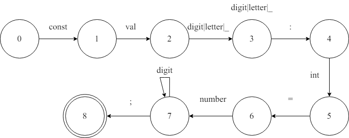
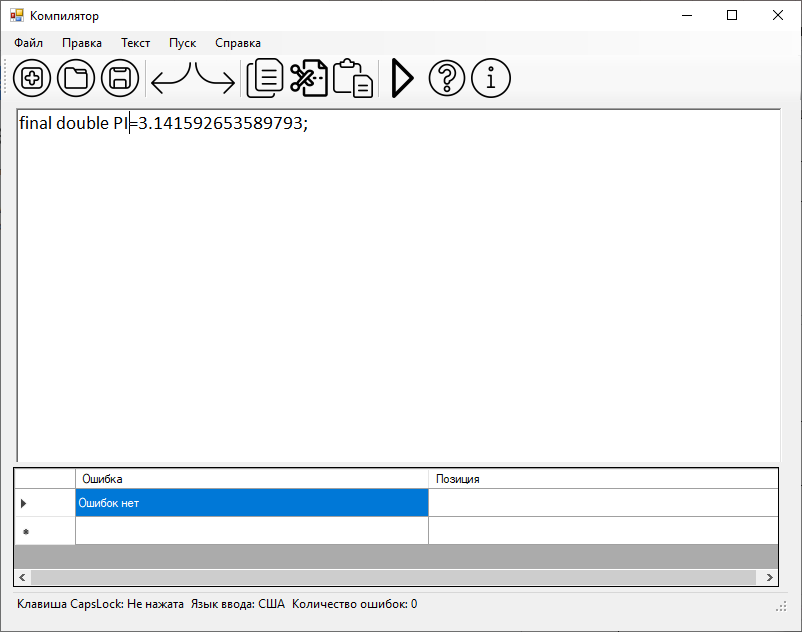
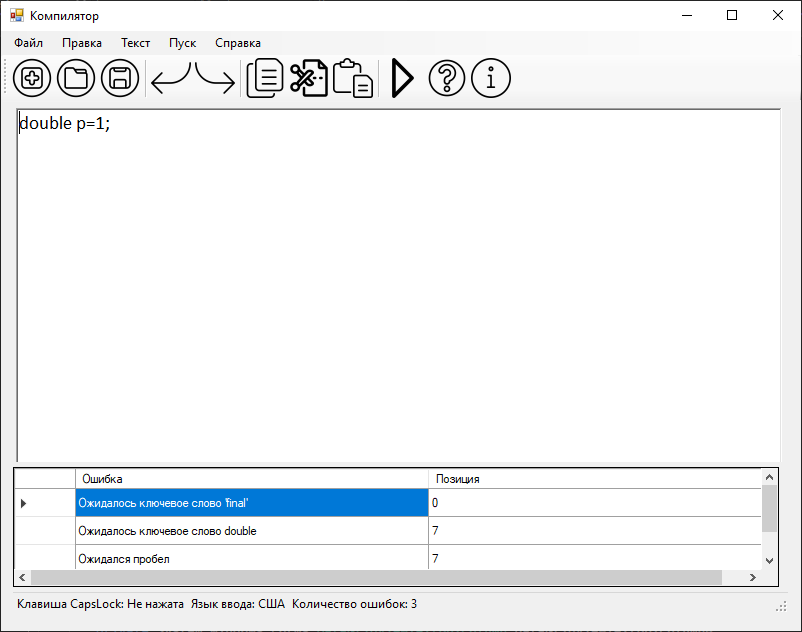

# Объявление вещественной константы с инициализацией на языке Java

## Примеры допустимых строк
```
final double PI = 3.141592653589793;
```

## Разработанная грамматика
```
<DEF> -> 'final' <FINAL>
<FINAL> -> 'double' <TYPE>
<TYPE> -> <IDENT>
<IDENT> -> LETTER (DIGIT | LETTER | '_')* <EQUALS>
<EQUALS> -> '=' <NUMBER>
<NUMBER> -> DIGIT+ <POINT> + <NUMAFTERPOINT> 
<NUMAFTERPOINT> -> DIGIT +<SEMICOLON>
<SEMICOLON> -> ';' <END>
```

## Граф конечного автомата


## Тестовые примеры


